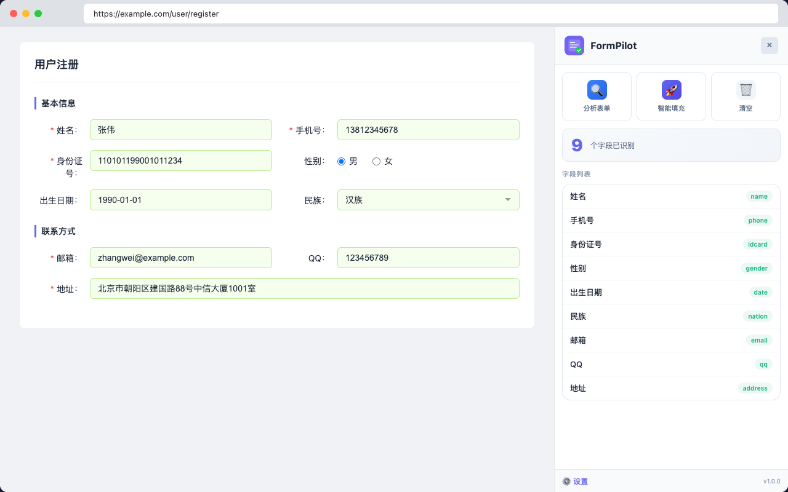
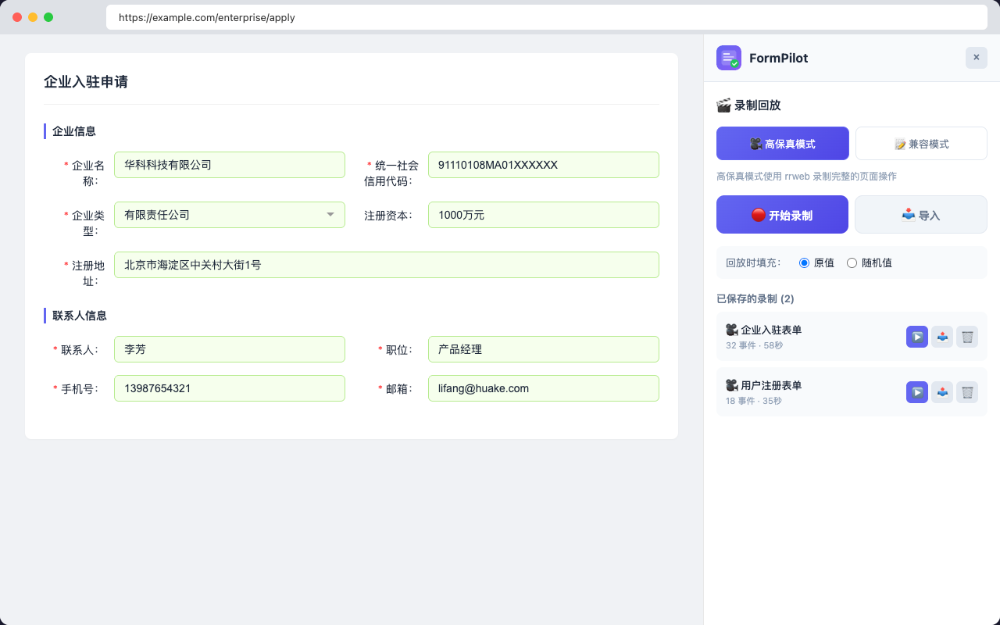

# FormPilot - 智能表单填充助手

  

  <strong>一键填充各种 UI 框架的表单，告别重复输入</strong>

  
  
  

---

FormPilot 是一款智能表单填充 Chrome 扩展，专为前端开发者和测试人员打造。它能自动识别页面上的表单字段，并生成符合格式要求的测试数据，大幅提升开发测试效率。

## ✨ 功能特性

### 🎯 智能字段识别
自动识别 60+ 种常见字段类型，无需手动配置：
- **基础信息**：姓名、性别、年龄、生日、民族、血型
- **证件号码**：身份证、护照、驾驶证、社保卡
- **联系方式**：手机号、座机、邮箱、QQ、微信
- **银行信息**：银行卡号、开户行
- **地址信息**：详细地址、省市区、邮编
- **教育信息**：学历、学校、专业
- **工作信息**：公司、职位、收入、工作年限
- **其他**：用户名、密码、验证码、日期、金额等

### 🔌 多框架支持
覆盖主流前端 UI 组件库：
| 框架 | 版本 | 状态 |
|------|------|------|
| Ant Design | PC | ✅ 支持 |
| Ant Design Mobile | 2.x / 5.x | ✅ 支持 |
| Element Plus | Vue 3 | ✅ 支持 |
| Vant | Vue 3 | ✅ 支持 |
| NutUI | Vue/React | ✅ 支持 |
| 问卷星 | wjx.cn | ✅ 支持 |
| 原生 HTML | - | ✅ 支持 |

### 🎬 录制回放
对于复杂表单（级联选择、动态字段等），支持录制回放功能：
- **录制操作**：记录每一个输入、点击、选择操作
- **原值回放**：使用录制时的原始值，适合回归测试
- **随机值回放**：自动生成随机值，适合压力测试

### 📋 页面配置
- 为特定页面保存字段映射规则
- 支持 URL 模式匹配
- 配置导入导出，团队共享

### 🔒 隐私安全
- 所有数据本地生成，不上传服务器
- 不收集任何用户信息
- 代码透明可审查

## 📥 安装方式

### Chrome 应用商店（推荐）
即将上线...

### 本地安装
1. 下载最新版本的 zip 包
2. 解压到本地文件夹
3. 打开 Chrome，访问 `chrome://extensions/`
4. 开启「开发者模式」
5. 点击「加载已解压的扩展程序」
6. 选择解压后的文件夹

## 🚀 使用方法

### 基本使用
1. 访问包含表单的网页
2. 点击页面右下角的悬浮按钮打开面板
3. 点击「智能填充」自动填充表单

### 快捷键
| 快捷键 | 功能 |
|--------|------|
| `Ctrl+Shift+F` (Mac: `Cmd+Shift+F`) | 一键填充 |
| `Ctrl+Shift+R` (Mac: `Cmd+Shift+R`) | 随机填充 |
| `Ctrl+Shift+C` (Mac: `Cmd+Shift+C`) | 清空表单 |

### 录制回放
1. 打开录制面板，点击「开始录制」
2. 手动填写表单
3. 点击「停止录制」保存
4. 下次访问时点击「回放」即可

## 📸 截图预览

  
  

## 📮 问题反馈

如果你在使用过程中遇到问题或有功能建议，欢迎提交 Issue：

| 类型 | 链接 |
|------|------|
| 🐛 报告 Bug | [提交 Bug 报告](../../issues/new?template=bug_report.md) |
| 💡 功能建议 | [提交功能建议](../../issues/new?template=feature_request.md) |

**提交前请：**
1. 搜索是否已有相同的 Issue
2. 使用对应的 Issue 模板
3. 提供尽可能详细的信息

## ❓ 常见问题

<strong>为什么某些字段没有被识别？</strong>

可能是字段名称不在默认规则中。你可以：
1. 在面板中手动修改字段类型
2. 在设置中添加新的识别规则
3. 提交 Issue 反馈

<strong>如何处理复杂的级联选择？</strong>

使用「录制回放」功能：
1. 手动填写一次表单
2. 保存录制
3. 下次一键回放

<strong>数据会上传到服务器吗？</strong>

不会。FormPilot 所有数据都在本地生成和存储，不会上传任何信息到服务器。

<strong>支持 Firefox 吗？</strong>

目前仅支持 Chrome 和基于 Chromium 的浏览器（Edge、Brave、Arc 等）。Firefox 版本正在开发中。

## 📧 联系方式

- 邮箱：yxp1213@gmail.com

## 📄 License

[MIT License](./LICENSE)

---

  如果觉得有用，欢迎 ⭐ Star 支持一下！

